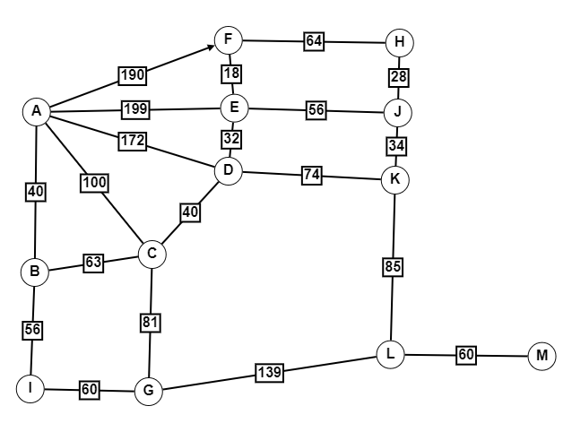

# Dijkstra's Algorithm

This repository contains a Python implementation of Dijkstra's algorithm for finding the shortest path between two nodes in a weighted graph.
This program was primarily made for a math project, but also out of interest.

## Overview

Dijkstra's algorithm is a widely used pathfinding algorithm that solves the single-source shortest path problem for a graph with non-negative edge weights, producing a shortest path tree. This algorithm is often used in routing and as a subroutine in other graph algorithms.

## Implementation

The implementation provided in this repository represents the graph as a dictionary of dictionaries. Each key in the outer dictionary is a node, and its value is another dictionary representing the neighbors of that node and the corresponding edge weights.

The main function `dijkstra(graph, start, end)` takes a graph, a starting node, and an ending node as input and returns a list representing the shortest path from the starting node to the ending node. If there is no path between the two nodes, the function returns `None`.

## Usage

1. Clone the repository to your local machine.
2. Import the `dijkstra` function from the `dijkstra.py` file into your Python script.
3. Create a graph in the appropriate format (dictionary of dictionaries) and call the `dijkstra` function with the graph, start node, and end node as arguments.

### Example

The following graph represents the walking distances between the junctions connecting the two famous tourist attractions, Frauenkirche and Marienplatz, in Munich, Germany.


```python
from dijkstra import dijkstra

# Example usage (Frauenkirche -> Marienplatz)
graph = {
    'A': {'B': 40, 'C': 100, 'D': 172, 'E': 199, 'F': 190},
    'B': {'A': 40, 'C': 63, 'I': 56},
    'C': {'A': 100, 'B': 63, 'D': 40, 'G': 81},
    'D': {'A': 172, 'C': 40, 'K': 74, 'E': 32},
    'E': {'A': 199, 'D': 32, 'F': 18, 'J': 56},
    'F': {'A': 190, 'E': 18, 'H': 64},
    'H': {'F': 64, 'J': 28},
    'J': {'E': 56, 'H': 28, 'K': 34},
    'K': {'J': 34, 'D': 74, 'L': 85},
    'L': {'M': 60, 'G': 139, 'K': 85},
    'M': {'L': 60},
    'G': {'L': 139, 'C': 81, 'I': 60},
    'I': {'B': 56, 'G': 60}
}

start = 'A'
end = 'M'
shortest_path = dijkstra(graph, start, end)

print(f"The shortest path from {start} to {end} is: {shortest_path}")